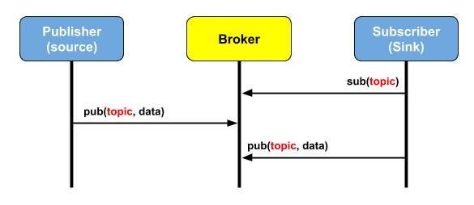

# MQTT란?
MQTT는 IOT를 위한 프로토콜로 최소한의 전력과 패킷량으로(빠름, 데이터 및 배터리 소모 적음) 통신하는 프로토콜입니다.

IOT와 모바일 어플리케이션 등의 통신에 매우 적합한 프로토콜입니다.

# MQTT의 구조
MQTT는 HTTP, TCP등의 통신과 같이 클라이언트-서버 구조로 이루어지는 것이 아닌, **Broker, Publisher, Subscriber 구조** 로 이루어집니다.

Publisher는 Topic을 발행(publish) 하고, Subscriber은 Topic에 구독(subscribe) 합니다. Broker은 이들을 중계하는 역할을 하며, 단일 Topic에 여러 Subscriber가 구독할 수 있기 때문에, 1:N 통신 구축에도 매우 유용합니다.

# MQTT의 QoS(Quality of Service)

MQTT의 QoS는 총 3단계가 있습니다.

* 0: 메세지는 한 번만 전달되며, 전달 이후의 수신과정을 체크하지 않는다.
* 1: 메세지는 한 번 이상 전달되고, 핸드셰이킹 과정을 추적하나, 엄격하게 추적하지 않기 때문에 중복수신의 가능성이 있다.
* 2: 메세지는 한 번만 전달되고, 핸드셰이킹의 모든 과정을 체크한다.

QoS의 단계가 높아질 수록 통신의 품질은 향상되지만, 그에 따라 성능 저하의 가능성이 있으므로 MQTT의 QoS는 프로젝트의 특성에 따라 결정되어야 합니다.

# MQTT 브로커
MQTT프로토콜을 구현하는 브로커들은 여러 것들이 있습니다.

* Mosquitto
* HiveMQ
* mosca
* ActiveMQ
* RabbitMQ (Plug-in 형태로 지원)

출처: https://medium.com/@jspark141515/mqtt%EB%9E%80-314472c246ee